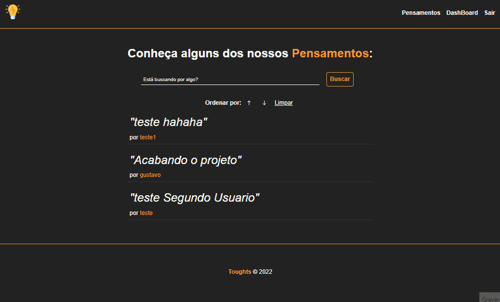

# Toughts

Um site para "Postar seu pensamento", fiz esse projeto com intuito de colocar em pratica oque aprendi, Meus maiores ensinamentos com este projeto foram:
<li> Arquitetura MVC
<li> Sistema de login/register 
<li>Autenticação de Usuario
<li> CRUD With MySql

## 🔧 Funçoes (opcional)

### Função 01:
- Busca por pensamento apartir de uma palavra

### Função 02:
- Ordenação por parametros de URL
  
### Função 03:
- Login/Register  

## Veja o desenvolvimento do projeto:

Para ver o desenvolvimento acesse o planejamento:

## Feito Com:

## Git Clone

- Clone this repository:
$ git clone https://github.com/GustavoMen/toughts
- Enter in directory:
$ cd toughts
- For install dependencies:
$ npm install
- Run the app: 
$ npm start

### Support Ou Contato

  
 
 Feito por Gustavo Mendonça
